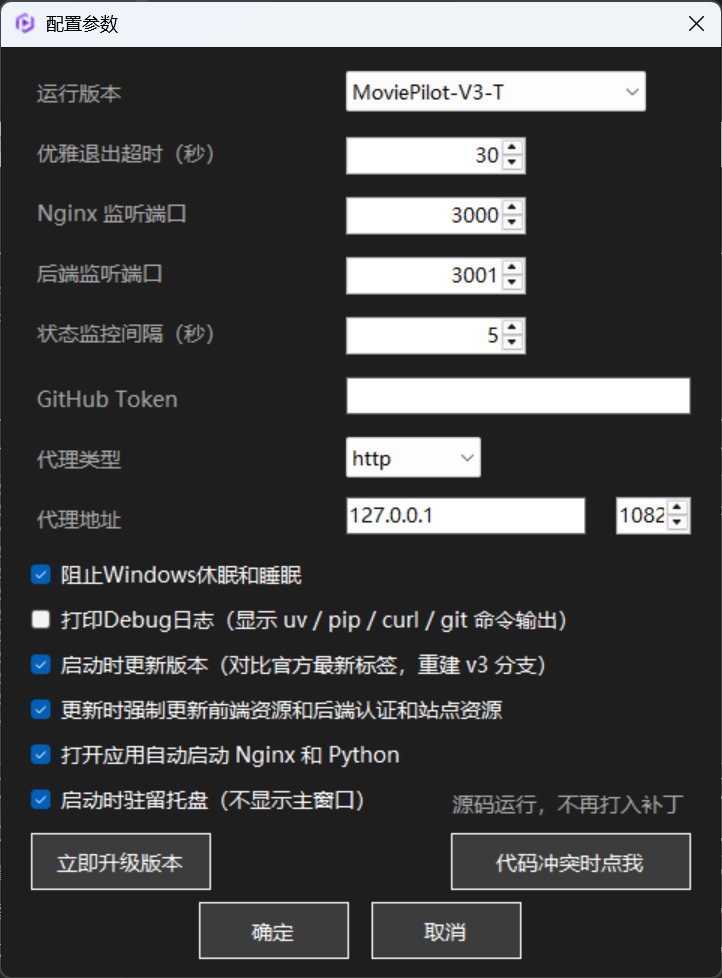
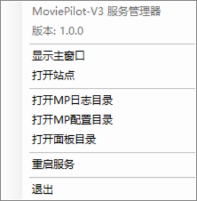

# MoviePilot-V3 详细说明

> 本文档包含运行环境要求、源码编译、配置项说明（config\app.ini）、命令行用法、补丁包说明、升级机制与配置保护、常见问题及杀毒软件误报说明；快速上手请查看主 [README.md](README.md)。

## 运行环境要求

- Windows 10 / 11 64 位（已在 Windows 24H2 验证）
- 必须安装 **.NET Framework 4.8 运行时**（本程序基于 4.8 构建，缺省会无法启动）

### 检测是否已安装 .NET Framework 4.8

PowerShell 窗口执行：

```powershell
(Get-ItemProperty "HKLM:\SOFTWARE\Microsoft\NET Framework Setup\NDP\v4\Full" -Name Release).Release -ge 528040
```

返回 `True` 表示已安装 4.8（Release 值大于等于 528040）。

或 CMD 窗口执行：

```cmd
reg query "HKLM\SOFTWARE\Microsoft\NET Framework Setup\NDP\v4\Full" /v Release
```

输出中 `Release` 的十六进制值大于等于 `0x528040`（即 528040）即为已安装 4.8。

未安装时请到微软官网下载：

> https://dotnet.microsoft.com/zh-cn/download/dotnet-framework/net48

### 其他说明

- 建议运行到非系统盘（如 D 盘），避免 Program Files 目录的权限问题
- **本程序不是安装包**：`MoviePilot-V3.exe` 是免安装的绿色单文件程序，直接双击即可运行，无需安装向导；请自行创建运行目录（如 `D:\MoviePilot`）并把 exe 放入其中运行，程序会在 exe 同级目录生成 config、runtime、server、mp-web、logs、tmp 等目录
- 首次启动服务时需要联网下载便携版组件（见下文）

## 编译（源码构建）

### 环境准备

- Windows 10 / 11 64 位
- **Visual Studio 2022（建议 17.13 及以上，支持 .slnx 解决方案格式）**，安装时勾选「**.NET 桌面开发**」工作负载（内含 .NET Framework 4.8 目标包与 MSBuild）
- 或单独安装 **.NET Framework 4.8 Developer Pack** + **Build Tools for Visual Studio**（MSBuild 命令行构建）

### 命令行编译

```powershell
# 方式一：MSBuild 构建 Release（产物在 bin\Release\）
msbuild MoviePilot-V3.slnx /p:Configuration=Release /restore

# 方式二：dotnet msbuild（等效）
dotnet msbuild MoviePilot-V3.slnx /p:Configuration=Release /restore
```

Debug 构建将 `Configuration` 改为 `Debug`，产物输出到 `bin\` 目录。也可直接用 Visual Studio 打开 `MoviePilot-V3.slnx` 编译。

### 关于打包

- **面板程序为单文件**：`bin\Release\MoviePilot-V3.exe` 无需附带其他文件即可运行
- `app.ico` 与 `config\` 模板（nginx.conf / common.conf）已作为**嵌入资源**编译进 exe：首次运行自动释放到 exe 同级目录（`app.ico`、`config\` 与 exe 平层），已存在时不再释放（保留本地修改）

## 配置项说明（config\app.ini）

面板「配置」对话框修改后自动保存到 `config\app.ini`（UTF-8 无 BOM，key=value 格式），可直接用记事本编辑。



| 参数 | 默认值 | 说明 | 生效方式 |
|---|---|---|---|
| `nginx_port` | `3000` | 前端访问端口（浏览器访问地址） | **保存即生效**：nginx 运行中自动重载；未运行时下次启动生效 |
| `backend_port` | `3001` | Python 后端 API 端口（nginx 反代目标） | nginx 侧**保存即生效**；**后端需重启服务**才能更换监听端口 |
| `github_token` | （空） | GitHub Token：下载站点资源、访问 GitHub 时携带认证头，可提高请求限额 | **保存即生效**（下次下载时使用） |
| `proxy_type` | （空） | 代理类型：`http` / `socks5`，空为关闭 | **保存即生效**：立即写入 git 全局代理（`git config --global http.proxy`），程序内所有下载（curl）同时走代理 |
| `proxy_host` | （空） | 代理 IP 或域名，**只填地址、不要带协议头**，如 `127.0.0.1` | **保存即生效**（同上） |
| `proxy_port` | `0` | 代理端口，如 `10829`（**无用户名 / 密码**，不支持认证型代理） | **保存即生效**（同上） |
| `shutdown_timeout_sec` | `30` | 停止服务时等待后端优雅退出的秒数，超时强制结束（插件较多时可调大，判断方法见下文「优雅退出」） | **保存即生效**（下次停止服务时使用） |
| `status_monitor_sec` | `5` | 面板服务状态检测间隔（秒，3~600），检测 nginx / Python 进程是否存活（方式见下文「状态监控」） | **需重启面板** |
| `start_minimized_to_tray` | `False` | 启动面板时直接驻留系统托盘（不显示主窗口） | **需重启面板** |
| `auto_update_on_start` | `False` | 面板启动时自动检查官方更新（有新版本自动升级并重启服务） | **需重启面板** |
| `force_update_resources` | `True` | 更新时（「立即升级版本」/「代码冲突时点我」）强制更新前端资源与后端认证 / 站点资源：即使版本号相同也重新下载覆盖（官方可能对同一版本号重新发布不同内容，详见下文「资源强制更新」） | 下次「立即升级版本」/「代码冲突时点我」时生效 |
| `auto_start_services` | `False` | 面板启动时自动启动 nginx / Python 服务 | **需重启面板** |
| `run_version` | `MoviePilot-V3` | 运行版本：标准版 `MoviePilot-V3`（默认）/ freethreaded 版 `MoviePilot-V3-T`（Python 免费线程版，详见下文「运行版本」） | **保存即生效**（下次启动服务时使用） |
| `debug_log` | `False` | 调试日志：开启后显示 uv / pip / curl / git 等子进程命令输出的 DEBUG 日志（默认仅显示 INFO / ERROR 主流程日志） | **保存即生效** |
| `prevent_sleep` | `False` | 阻止 Windows 空闲休眠 / 睡眠（面板运行期间生效，退出面板时自动恢复） | **保存即生效** |

> 说明：`nginx_port` / `backend_port` 修改保存时，面板会更新 nginx 配置模板、同步到 nginx 实际加载的 conf\ 目录并自动重载生效（nginx 未运行时下次启动生效）。
> 
> **面板修改端口会重载 nginx，后端端口需重启服务后生效（MP后端启动时,传入后端端口环境变量 `PORT`）。

### 运行版本（run_version）

面板支持两套后端运行版本，在配置窗口「运行版本」下拉框中选择：

- **标准版 `MoviePilot-V3`**（默认）：Python 3.14.7 标准解释器
- **freethreaded 版 `MoviePilot-V3-T`**：Python 3.14.7t 免费线程（free-threaded）解释器，移除 GIL 后可充分利用多核 CPU，适合并行下载等场景（首次使用前需准备本机编译环境：VS C++ 工具链 + Rust + PostgreSQL，详见 [freethreaded 版环境准备指南](README-freethreaded.md)）

两版**共用 nginx、端口与前端资源**，但 Python 解释器（`runtime\Python3.14.7t`）、虚拟环境（`runtime\venv_t`）与后端代码目录（`server\MoviePilot-V3-T`）**完全隔离**，站点资源文件（sites.pyd / user.sites.v3.bin）也按版本区分下载，互不干扰。**一次只运行一个版本**（共用端口），切换版本后下次启动服务时自动停止旧版本并启动新版本。

### 优雅退出（shutdown_timeout_sec）

停止服务时，面板会先向后端发送停机信号（Ctrl+Break），等待其优雅收尾（停止定时任务 → 停止插件 → 关闭模块运行时 → 停止消息队列 → 停止事件处理），超过 `shutdown_timeout_sec` 仍未退出才强制结束进程。

**如何判断是否被强制杀死**：查看后端日志 `server\MoviePilot-V3\config\logs\moviepilot.log`，一次完整的停机日志如下（截取自真实日志）：

```text
【INFO】2026-08-29 15:52:34,045 [-] - monitor.py - 未启用插件文件修改监测，无需停止
【INFO】2026-08-29 15:52:34,047 [-] - monitor.py - 定时监控服务已停止
【INFO】2026-08-29 15:52:34,048 [-] - scheduler.py - 定时任务停止完成
【INFO】2026-08-29 15:52:34,050 [-] - transfer.py - 文件整理 worker 与待处理回放线程已关闭
【INFO】2026-08-29 15:52:34,051 [-] - lifecycle.py - 正在停止所有插件...
【INFO】2026-08-29 15:52:34,052 [-] - lifecycle.py - 正在停止所有插件...
【INFO】2026-08-29 15:52:34,053 [-] - lifecycle.py - 正在停止所有插件...
【INFO】2026-08-29 15:52:34,055 [-] - lifecycle.py - 插件停止完成
【INFO】2026-08-29 15:52:34,056 [-] - module_manager.py - 正在关闭模块运行时...
【INFO】2026-08-29 15:52:34,605 [-] - module_manager.py - 模块运行时关闭完成
【INFO】2026-08-29 15:52:34,608 [-] - message.py - 正在停止消息队列...
【INFO】2026-08-29 15:52:34,608 [-] - message.py - 消息队列已停止
【INFO】2026-08-29 15:52:34,606 [-] - events.py - 正在停止事件处理...
【INFO】2026-08-29 15:52:34,606 [-] - events.py - 事件处理停止完成
```

- 如果日志在中间截断（没走到「事件处理停止完成」），说明停机超时、进程被**强制杀死**，部分任务可能未收尾完毕
- 插件越多，停机收尾耗时越长：请根据后端日志中实际输出的停机耗时，把 `shutdown_timeout_sec` 调整到合理值（略大于日志中的停机总耗时），保存后下次停止服务即生效

### 状态监控（status_monitor_sec）

面板上「Nginx / Python」的服务状态由该参数控制检测频率，默认每 5 秒检测一次，可配置范围 3~600 秒。

检测方式：Nginx 读取其安装目录的 `runtime\Nginx\logs\nginx.pid` PID 文件，仅当 PID 文件存在且对应进程仍存活时才显示「运行中」；Python 后端不依赖 PID 文件，通过系统 PowerShell 查询进程命令行特征（可执行文件位于 `runtime\` 便携版目录且命令行包含 `server\app\main.py`）判断，匹配到任一存活进程即视为运行中。两者都不会把系统里其他同名进程误判为服务。

### 关机 / 重启自动收尾

面板检测到 Windows 关机 / 重启时，会**拦截本次关机请求**并在系统关机界面显示「正在停止 MoviePilot 服务并保存配置，请稍候...」提示，随后转入后台执行收尾：停止服务（WMI 查询 + Ctrl+Break 优雅退出，超时强制结束）→ 终止残留的下载 / 命令子进程 → 恢复系统睡眠设置 → 退出进程，系统检测到无阻止者后自动继续关机 / 重启流程。**注销登录不拦截**，直接放行。

- 面板进程已提升**关机优先级**，确保先于 nginx / Python 服务进程收到系统通知，服务进程仍存活时优雅停止链路才能生效
- 收尾日志同时写入面板 `logs\shutdown.log`（追加式，保留最近一次完整链路），面板进程随即退出、日志区内容会丢失，排查问题时请查看该文件

### 代理（proxy_type / proxy_host / proxy_port）

- `proxy_host` 只填写 IP 或域名，**不要写协议头**（不要填 `http://127.0.0.1`，直接填 `127.0.0.1`）
- 只需填写地址与端口两项即可，**无用户名 / 密码**（认证型代理无法使用）
- 保存后立即写入 git 全局代理并作用于所有下载；本地代理工具（Clash、v2rayN 等）直接填其监听地址与端口即可
- **Python 后端的代理注入**：配置代理后启动后端时，会向后端进程注入 `HTTP_PROXY` / `HTTPS_PROXY` / `ALL_PROXY` 环境变量（大小写同时注入），requests / httpx 等网络库自动走代理；同时注入 `NO_PROXY` **排除常规局域网地址**：本机回环（localhost、127.0.0.1、::1）与私有网段（10.0.0.0/8、172.16.0.0/12、192.168.0.0/16）及链路本地（169.254.0.0/16），保证后端访问本机与局域网内服务时不会被代理劫持

## 命令行用法

面板托盘图标右键菜单与命令行均可控制服务，命令行方式适合脚本、计划任务调用：



```cmd
MoviePilot-V3.exe -c start     # 启动服务（首次运行自动准备环境：下载组件、建虚拟环境、同步代码与补丁）
MoviePilot-V3.exe -c stop      # 停止全部服务（优雅退出，超时强制结束）
MoviePilot-V3.exe -c restart   # 重启服务（先确保环境就绪 → 停止 → 启动；纯重启，不检查更新）
MoviePilot-V3.exe -c update   # 升级版本（与配置窗口「立即升级版本」一致：停止 → 更新代码与补丁 → 安装依赖 → 同步前端 → 重启服务）
```

- 命令执行日志：面板正在运行时实时显示在面板「运行日志」区；面板未运行时写入 `logs\cmd.log`
- `-c` 后接未知命令、或首个参数不是 `-c` 时，提示支持的命令列表后退出
- **restart 特例**：若后端配置 `server\config\app.env` 中设置了 `MOVIEPILOT_AUTO_UPDATE=release/dev`，`-c restart` 将先检查官方更新并升级（等效 Docker 容器重启自动更新），再启动服务
- **面板交互**：托盘图标**左键单击**切换主窗口显示 / 隐藏（右键弹出菜单）；点击「重启服务」前会弹出**二次确认对话框**，防止误操作
- 不带参数直接双击即打开可视化面板

## 补丁包说明（v3-rebase）

面板在克隆 / 更新后端代码后，会自动合入 **v3-rebase 补丁**（cherry-pick 方式，幂等，已应用过的自动跳过），在官方 MoviePilot 基础上补充以下能力：

1. **Web 端重启**：可在 MoviePilot 网页后台直接重启后端服务，无需回到面板操作
2. **认证与站点资源重启下载**：启动后端前按标记重新下载认证 / 站点资源文件（sites.pyd / user.sites.v3.bin），保证资源版本最新
3. **类似 Docker 的重启自动升级**：重启服务时自动检查官方最新标签，有新版本自动升级并重新打补丁，等效于 Docker 容器重启自动更新
4. **补丁增量更新**：启动 / 升级时对比补丁分支远程最新提交时间与本地记录（`last_rebase_patch_time_v3` / `last_rebase_patch_time_t`，按运行版本目录分开记录，切换版本互不污染），有新补丁自动拉取合入
5. **补丁冲突回退**：补丁合入发生冲突时自动清理残留 cherry-pick 状态、强制重建官方 v3 基线并回退到**官方纯净版**运行，不阻塞服务，下次升级再重试

## 升级机制与配置保护

### 升级方式

- **立即升级**：配置窗口点击「立即升级版本」按钮
- **启动时自动升级**：开启配置项「启动时更新版本」（`auto_update_on_start`），面板启动时自动检查并升级
- **命令行升级**：`MoviePilot-V3.exe -c upgrade`

升级流程：停止服务 → 获取官方（jxxghp）最新版本标签并对比本地代码（本地历史包含官方标签即视为已最新）→ 有新版本则从官方拉取标签、重建 v3 分支并重新合入 v3-rebase 补丁 → 更新 Python 依赖 → 同步前端资源 → 重启服务。官方源无版本标签时回退为 `git pull` 更新。

**升级是安全的**：官方最新版本不可用（网络异常、上游强制覆盖等）或升级失败时自动放弃，继续使用当前版本运行，不会中断服务。补丁合入发生冲突时同样自动回退到官方纯净版基线，保证服务可用。

### 资源强制更新（force_update_resources）

「立即升级版本」与「代码冲突时点我（源码运行）」完成后会同步资源，配置窗口「更新时强制更新前端资源和后端认证和站点资源」（默认勾选，对应 `force_update_resources=True`）控制是否**强制覆盖**：

- **前端资源**（`mp-web\`，各版本共用）：默认按后端 `version.py` 的 `FRONTEND_VERSION` 与 `mp-web\version.txt` 对比，**版本更高才下载覆盖**。注意：官方前端存在**版本号相同、资源内容不同**的情况——同一版本号的发行包可能被重新发布（内容修正 / 重新打包），仅按版本号比较会漏更；勾选后即使版本号相同也会重新下载覆盖，保证拿到最新内容；本地版本高于要求时（自行替换过更高版本前端）不覆盖
- **认证资源**（`sites.cp314-win_amd64.pyd` / `sites.cp314t-win_amd64.pyd`，位于 `server\<运行版本>\app\application\site`，按运行版本区分）：勾选后强制重新下载覆盖
- **站点资源**（同目录 `user.sites.v3.bin`）：勾选后强制重新下载覆盖

强制下载失败时自动恢复原文件并记录日志，不阻塞升级流程（下次更新会重试）。取消勾选则恢复默认行为：前端仅版本更高时下载，认证 / 站点资源仅在缺失或不完整时由启动服务流程补下载。

### 会不会覆盖用户配置

- **面板配置 `config\app.ini`**（端口、代理、Token 等）：位于 exe 同级目录，**不在代码仓库内，升级完全不影响**
- **后端配置 `server\config\app.env`**（后端端口、认证等）：已被代码仓库的 `.gitignore` 忽略，**git 升级不会触碰, 不影响**
- **运行时数据**（`server\config` 下的 logs、cache、cookies、temp、user.db 等）：不参与版本控制，升级不动, 不影响
- **分类配置 `config\category.yaml`**：受面板自动备份保护——停机时、检测到官方新版本升级前都会自动备份到面板 `config\category.yaml`（内容不同才覆盖）；升级成功后若备份含你的修改，会自动恢复覆盖回 `server\config\category.yaml`，修改不丢失
  > **修改方式规范**：`category.yaml` **只允许在 MoviePilot Web 界面中使用官方二级分类策略插件修改**；**不要在面板停止服务后直接编辑源文件 `server\config\category.yaml`**。否则停机期间的手动修改不会被备份捕获（备份反映的是停机前通过 Web 的修改），升级重建分支时将被官方新模板覆盖，修改会丢失
- **未跟踪的残留文件**：升级前自动移出到 `tmp` 目录备份，避免干扰签出

## 常见问题

- **页面 502 / 无法访问**：后端冷启动约需 30~60 秒（初始化数据库、加载插件），稍等片刻刷新即可；也可查看面板日志区的后端启动输出
- **首次下载很慢或失败**：强烈建议先在「配置」中设置好代理与 GitHub Token 再启动服务（国内网络环境几乎必需）
- **端口被占用**：修改 `nginx_port` / `backend_port` 为未占用端口（保存后 nginx 自动重载）
- **排查后端错误（前台运行）**：点击托盘图标右键 →「打开面板目录」，在目录空白处按住 Shift + 鼠标右键 →「在此处打开 PowerShell / 在此处打开 CMD」，输入以下命令，前台运行后端查看报错：

  ```cmd
  .\runtime\venv\Scripts\python.exe .\server\MoviePilot-V3\app\main.py
  ```

  以标准版 `MoviePilot-V3` 为例（虚拟环境 `runtime\venv`）；freethreaded 版对应为 `runtime\venv_t` + `server\MoviePilot-V3-T`

## 关于杀毒软件误报

- **VirScan 多引擎在线扫描全部通过**：本程序未命中任何已知病毒签名
- **VirusTotal 里的Microsoft引擎可能报 `Trojan:Win32/Wacatac.C!ml`，属于误报**：毒名后缀 `!ml` 表示该检测来自 Microsoft 的机器学习引擎——基于文件信誉对未知程序做模型评分，而非命中已知病毒特征库
- **程序向外发送域名的请求**：全部网络请求仅限 **nginx 官网**（下载 [nginx](https://nginx.org/en/download.html)）、**GitHub 官网**（下载 **[Git](https://github.com/git-for-windows/git/releases/tag/v2.55.0.windows.4)**、**[Python](https://github.com/astral-sh/python-build-standalone/releases/tag/20260814)**、**[uv](https://github.com/astral-sh/uv/releases/tag/0.12.5)**、**[MoviePilot](https://github.com/jxxghp/MoviePilot/releases)**、**[MoviePilot-Frontend](https://github.com/jxxghp/MoviePilot-Frontend)**、**[MoviePilot-Resources](https://github.com/jxxghp/MoviePilot-Resources)**、**[v3-rebase](https://github.com/developer-wlj/MoviePilot/tree/v3-rebase)**）与 **[v3-rebase 国内源](https://gitee.com/vueconfig/MoviePilot/tree/v3-rebase/)**，不包含其他第三方域名
- **代码已开源**：完整源码在本仓库，可自行编译复现，也可交给任意 AI 进行代码审查
- **无数字签名证书**：本程序未购买数字签名证书，因此 Windows SmartScreen 与部分杀毒软件可能提示未知发布者；介意者请勿使用，或自行编译源码运行
