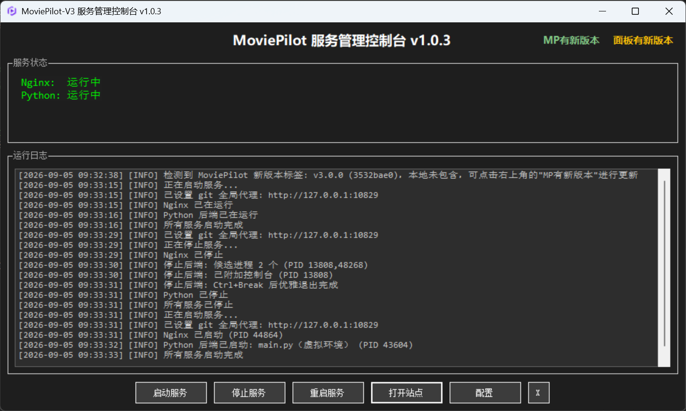

# MoviePilot-V3 服务管理面板（Windows）

基于 **.NET Framework 4.8** 构建的 MoviePilot v3 一键管理面板：托盘图标 + 可视化界面，傻瓜式启动 / 停止 / 重启全套服务（nginx 前端 + Python 后端），首次使用自动下载便携版运行环境，无需手动配置任何命令行。

## 特点

- **傻瓜式可视化**：全部操作只需点击按钮，无需任何命令行知识
- **零手动环境配置**：nginx / Git / Python / uv 便携版自动下载安装，与系统环境互不干扰
- **自动建虚拟环境**：后端运行在独立 venv 中，依赖隔离、可随时重建
- **自动更新与补丁**：重启服务时自动检查官方最新版本，并自动合入 v3-rebase 补丁（幂等，已应用自动跳过）
- **GitHub 加速友好**：支持 Token 与 HTTP / SOCKS5 代理（下载、git 均生效）
- **托盘常驻**：最小化到托盘，状态一目了然；支持开机后手动一键拉起服务
- **优雅停止**：停止时优先发送停机信号等待任务收尾，超时再强制结束，兼顾数据安全与响应速度
- **关机自动收尾**：Windows 关机 / 重启时自动拦截并优雅停止服务、终止残留子进程后再放行，避免服务数据损坏
- **托盘左键切换**：托盘图标左键单击即可切换主窗口显示 / 隐藏（右键为菜单），操作更顺手
- **阻止系统休眠**：可开启阻止 Windows 空闲休眠 / 睡眠，保证长时间下载与任务运行不中断
- **双版本后端**：支持标准版与 freethreaded 版（Python 免费线程）后端环境，独立隔离、一键切换

## 目录结构

```
MoviePilot-V3\
├── MoviePilot-V3.exe          # 主程序（面板 / 命令行）
├── config\                    # 面板配置（app.ini、nginx.conf、common.conf；模板首启自动释放）
├── app.ico                    # 面板图标（首启自动释放，exe 内已嵌入）
├── runtime\                   # 便携版运行时（首次启动自动准备）
│   ├── Nginx\                 # nginx（配置在 conf\，由面板模板同步）
│   ├── Git\                   # Git 便携版
│   ├── Python3.14.7\          # Python 便携版（标准版后端）
│   ├── Python3.14.7t\         # freethreaded 版 Python（运行版本为 MoviePilot-V3-T 时使用）
│   ├── venv\                  # Python 虚拟环境（标准版后端运行于此）
│   ├── venv_t\                # freethreaded 版虚拟环境（MoviePilot-V3-T 后端运行于此）
│   └── uv\                    # 包管理：替代pip (约束依赖版本)
├── server\                    # MoviePilot 后端代码（官方源 + v3-rebase 补丁）
│   ├── MoviePilot-V3\         # 标准版后端（默认运行版本）
│   └── MoviePilot-V3-T\       # freethreaded 版后端（运行版本为 MoviePilot-V3-T 时使用）
├── mp-web\                    # 前端页面（可替换为自己的构建产物）
├── tmp\                       # 下载缓存（压缩包，可清理）
└── logs\                      # 面板 / 命令行日志（cmd.log）、关机收尾日志（shutdown.log）
```

## 快速开始

> **强烈建议首次运行前先完成配置**：打开面板后先点「配置」，设置好 **代理**（`proxy_type` / `proxy_host` / `proxy_port`）和 **GitHub Token**（`github_token`），再点启动服务。国内网络环境下不配代理，首次下载便携版组件、站点资源与克隆代码可能很慢甚至失败；填写规则见 [详细说明](README-advanced.md) 中「代理」一节。

1. 双击 `MoviePilot-V3.exe` 打开面板（默认显示主窗口，可在配置中改为启动即驻留托盘）
2. 点击 **启动服务**：首次运行会自动完成以下准备（只需一次）：
   - 下载便携版 **nginx**、**Git**、**Python 3.14.7**、**uv**（压缩包保存在 `tmp目录`，解压到 `runtime目录`）
   - 创建 Python 虚拟环境并安装后端依赖
   - 下载站点资源文件（sites.pyd / user.sites.v3.bin）
   - 克隆后端代码并自动合入 v3-rebase 补丁
3. 等待后端初始化完成后（约 30~60 秒），浏览器访问：`http://127.0.0.1:3000`
4. 默认账号 `admin`，首次密码随机生成，请查看后端日志（`server\config\logs\moviepilot.log`）



> 运行环境要求、源码编译、配置项说明（config\app.ini）、命令行用法、补丁包说明、升级机制与配置保护、常见问题等详细内容见 [README-advanced.md](README-advanced.md)

## 致谢

本项目基于以下开源项目构建，特此感谢：

- [Nginx](https://nginx.org/)：高性能 Web 服务器与反向代理，提供前端服务
- [Git](https://git-scm.com/)：分布式版本控制系统，用于代码克隆与管理
- [Python](https://www.python.org/)：后端运行环境（Python 3.14.7）
- [Roslyn](https://github.com/dotnet/roslyn) / [MSBuild](https://github.com/dotnet/msbuild)：C# 编译器与构建工具链
- [MoviePilot](https://github.com/jxxghp/MoviePilot)：MoviePilot 核心项目（后端代码）
- [MoviePilot-Frontend](https://github.com/jxxghp/MoviePilot-Frontend)：MoviePilot 前端项目
